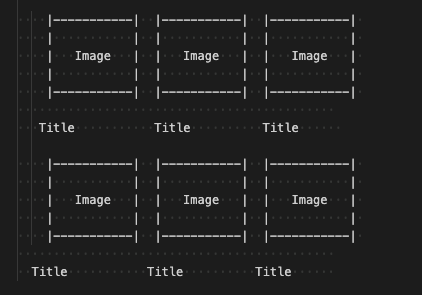
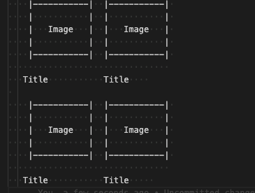

# react-assessment

Welcome, you are on your way to become a part of Gapstars story. This is will be your first assesment. I wish you good luck.

🍿 Search Receipe Site

Let's build a simple website that has a search box where an user will be able to search for receipes by name and see the list of the results. The results will be fetched from an external API on the backend. The frontend & backend should be in the same repo for the sake of simplicity. 

External API
Use Spoonacular API to get list your list of receipes.
API docs: https://spoonacular.com/food-api/docs

Example request: https://api.spoonacular.com/recipes/search?query=cheese

If you have trouble getting an API key, please reach out for us

# 🛠 Main Requirements

* The code should be written in ES6 as much as possible
* Use the create-react-app generator to start your project.
* Build a single page app with React & Redux with the following functionality
* There should be 2 container components
* There should be 5 stateless components
* There should be 2 routes

Frontend

* Display a search bar where a user can type a search keyword
* Display the results as a grid of 3 columns and responsive, for each movie display the movie poster returned from API and the   movie title below it

* On mobile screens (width <= 768px), the grid will be 2 columns

* If the user is typing, don't make any API calls until they stop typing for 300ms.
* On click of each card route the user to a simple view that has all details about receipe. 
* The Application must make use of react-router and proper RESTful routing (should you choose to use react-router v3 please    refer to the appropriate docs; docs for v4 can be found here)
* Use Redux middleware to respond to and modify state change
* Make use of async actions and redux-thunk middleware to send data to and receive data from a server
* Your client-side application should handle the display of data with minimal data manipulation
Your application should have some minimal styling: feel free to stick to a framework (like react-bootstrap/material-ui), but if you want to write (additional) CSS yourself, go for it!
* Consider all the possible UI states: initial, loading, error,... and present them to the user clearly. No fancy UI required

Go wild! These are only the basic requirements — you're free to add on as much stuff as you'd like. Branch out and commit your code once you're done.

# Assessment

Be prepared to

* Explain your code. You might be asked why you chose to solve things a certain way, or why you chose a certain library or code structure.
* Refactor/reorganize your code.
* Build out extra basic functionality.

What won't happen
* You won't be told you're ever wrong
* You won't be put on the spot without support
* There's nothing you can do to instantly fail or blow it.
